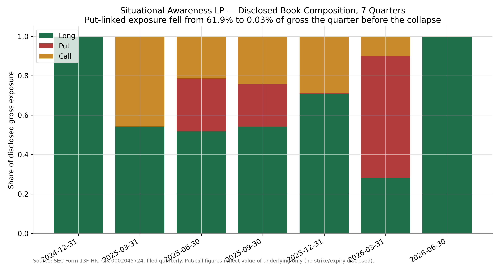
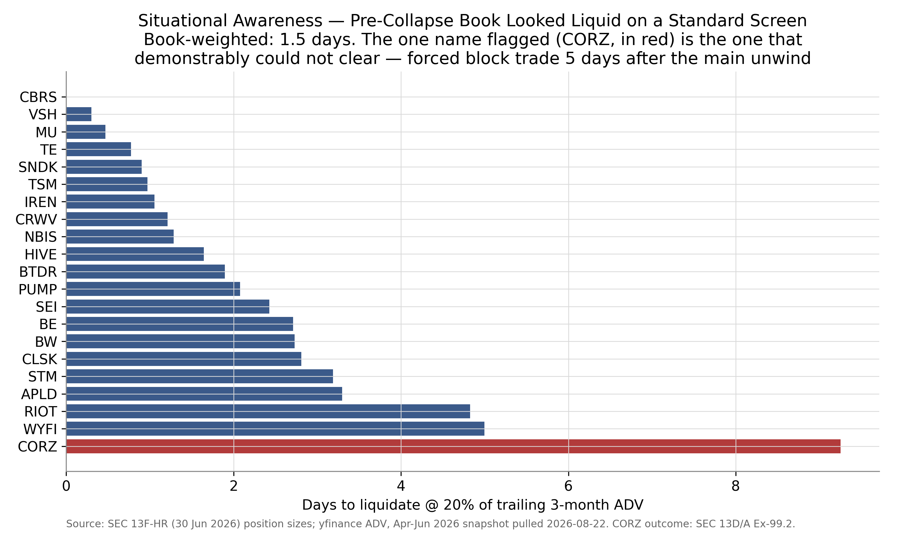
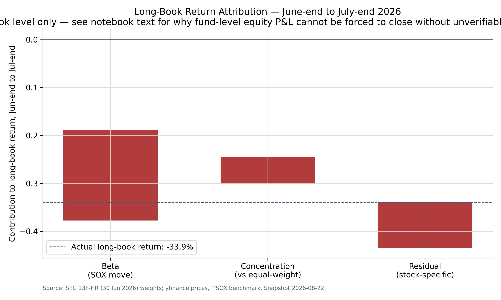
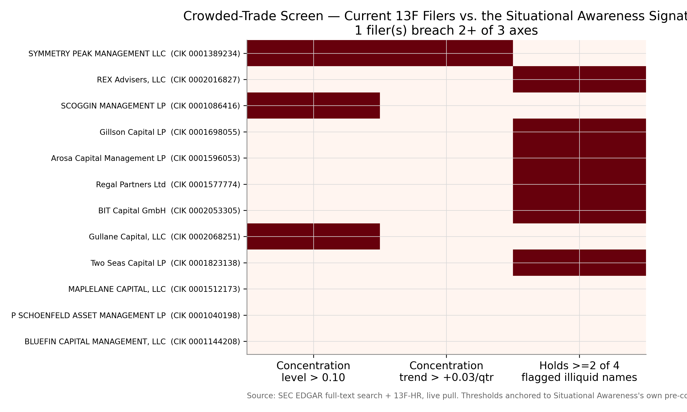

# Situational Awareness Unwind — Forced Deleveraging & Crowded-Trade Engine

> In July 2026 a $45bn AI hedge fund lost 67% in one month and was liquidated
> into a Citadel block trade. Every published account blames 4x leverage.
> Its own SEC filings show something else: in the quarter before the
> collapse, the fund's put-linked exposure fell from 61.9% to 0.03% of gross,
> two positions flipped from a put to a larger long on the identical issuer,
> and top-5 concentration rose from 48.7% to 77.3%. This project reconstructs
> the book from primary filings, decomposes the July drawdown into four
> drivers, validates a liquidity model against a documented forced-sale
> outcome, stress-tests the scoring engine out-of-sample (and reports where
> it fails), and screens the CURRENT market for filers sharing the same
> multi-axis risk signature.

## Core Question
Did Situational Awareness die of leverage, or of un-hedging? What does the
July drawdown actually decompose into once priced against real market data —
and which live 13F filers today share the same concentration-trend-liquidity
geometry?

## Key Findings

| Finding | Value |
|---|---|
| Disclosed 13F book, 30 Jun 2026 (last filing before collapse) | $20.24bn gross / 26 entries — of which $20.17bn long across 23 positions |
| Top-2 concentration (SanDisk 28.0% + Micron 27.5%) | 55.5% of disclosed gross |
| Put-linked exposure, Q1 2026 → Q2 2026 | 61.9% of gross → 0.03% of gross |
| Sign-flipped positions (PUT in Q1 → larger LONG in Q2, same issuer) | Micron, TSMC |
| Herfindahl index, Q1 2026 → Q2 2026 | 0.070 → 0.176 |
| Book-weighted days-to-liquidate @ 20% ADV (pre-collapse) | 1.55 trading days — the book screened LIQUID |
| Least-liquid single position (Core Scientific) | 9.25 days — confirmed rank #1, and the position that demonstrably could not clear on schedule |
| Documented forced block-trade discount (Core Scientific, 3 Aug) | 12.2% below mid-July open-market prints |
| Actual long-book return, Jun-end → Jul-end (priced, this project) | −33.9% |
| — of which sector beta (SOX index) | −18.9% |
| — of which concentration effect vs. an equal-weighted version of the same names | −5.6% |
| — residual (stock-specific) | −9.5% |
| Counterfactual: retained Q1 put book would have added (range, strike/tenor grid) | $45.1M – $169.2M against July losses |
| Reported fund-level equity loss (unaudited, investor letter) | −67% — **not force-reconciled to the long-book number**, see Limitations |
| Out-of-sample validation (Melvin, Tiger Global vs. Berkshire, Renaissance controls) | Naive concentration screen does **not** cleanly separate blow-ups from controls — a stated negative result that redesigned the live screen |
| Live screen: current 13F filers breaching 2+ of 3 risk axes | 1 of 12 screened (Symmetry Peak Management LLC — HHI 0.103 → 0.237 in one quarter) |

## Exhibits

**Put-linked exposure eliminated the quarter before the collapse:**


**The book screened liquid on a standard measure — the one flag it produced was the one position that actually failed to clear:**


**July's actual priced loss, decomposed into beta, concentration, and residual — the reported −67% equity loss is deliberately not force-reconciled to this:**


**The live decision: which current 13F filers breach 2+ of the 3 risk axes (per-axis detail matters — see Limitations #8):**


## Methodology
- Reconstructed 7 quarters of positions from SEC 13F-HR XML (CIK 0002045724),
  validating every quarter against the filing's own `<tableValueTotal>` (one
  quarter carries a documented $1 filer-rounding artifact, logged and
  tolerated, not hidden)
- De-duplicated a related-entity filer (CIK 0002038540) that reports
  identical Q1-2026 holdings — summing across both would silently double the
  book
- Recovered trade-level forced-sale evidence from the Schedule 13D/A Exhibit
  99.2 transaction blotter on Core Scientific — dated, priced, share-counted
- Built days-to-liquidate from position size and trailing 3-month ADV
  (yfinance), then validated the cross-section against which position
  demonstrably failed to clear on schedule
- Decomposed the priced July return into beta, concentration, and residual
  drivers; reported the hedge-counterfactual as a range over strike/tenor
  assumptions, never a false-precision point estimate
- Declined to force-reconcile the long-book price return to the fund's
  reported −67% equity loss — doing so would require assuming leverage and
  short-book P&L this project cannot independently verify from public data
- Validated the concentration-scoring engine out-of-sample on two unrelated
  13F filers with documented large drawdowns (Melvin Capital, pre-GME;
  Tiger Global, pre-2022) against two large diversified controls (Berkshire
  Hathaway, Renaissance Technologies) — the naive version FAILED to separate
  them cleanly, which is reported as a finding, not smoothed over, and used
  to redesign the live screen around three axes instead of one
- Screened the current market via SEC EDGAR full-text search for 13F filers
  co-holding the same illiquid names, scored on concentration level,
  concentration trend, and multi-name crowding

## Project Structure
```
situational-awareness-unwind/
├── data/
│   ├── raw/
│   │   ├── edgar/13f/       # 7 quarters, XML as filed, immutable
│   │   ├── edgar/13dg/      # 13D/A + Ex-99 forced-sale blotter
│   │   └── edgar/formd/     # Form D/A capital raised
│   ├── processed/           # Tidy panel, reconciliation log, observability audit
│   ├── external/            # Benchmark + control filer 13Fs (out-of-sample)
│   └── final/                # attribution.csv, live_screen.csv — terminal artifacts
├── notebooks/                # 01-08, sequential, executed against live SEC/market data
├── src/                      # Reusable EDGAR fetch/parse + risk (concentration, liquidity, margin) modules
├── outputs/{charts,tables}/  # 300 DPI exhibits, CSV tables
├── model/                    # Auditable Excel margin calculator (mirrors src/risk/margin.py to the dollar)
├── reports/                  # DATA_DICTIONARY, RECONCILIATION, findings, EXECUTIVE_SUMMARY.pdf, RISK_MEMO.pdf
├── requirements.txt
└── README.md
```

## Data / Sources
All public and free. SEC EDGAR (13F-HR, 13D/A + Ex-99, Form D/A, full-text
search), CIK 0002045724 (Situational Awareness LP) and CIK 0002038540
(Situational Awareness Partners LP, confirmed duplicate). Prices/volume via
yfinance, pulled and timestamped 22 Aug 2026. No paid terminal used anywhere
in this project.

## How to Run
```
pip install -r requirements.txt
jupyter nbconvert --to notebook --execute --inplace notebooks/01_edgar_ingest.ipynb
jupyter nbconvert --to notebook --execute --inplace notebooks/02_position_panel.ipynb
# ...through 08_live_screen.ipynb, in order — each depends on the prior notebook's output
```
Notebooks are also kept as `.py` (jupytext light format) alongside the
`.ipynb` files for clean diffs.

## What This Analysis Can and Cannot See
Form 13F discloses long US-listed equity and listed options only. It does
**not** disclose: short positions held via swaps or OTC instruments (the
fund's reported software shorts, e.g. Adobe, are invisible here), non-US
listings (SK Hynix, Korea-listed, is absent from every quarter despite being
widely reported as a core position), the private book (the fund's Anthropic
stake), or any leverage figure directly. Filings arrive with a 45-day lag.
Option entries disclose the value of the underlying only — no strike,
expiry, or bought/written flag — so every use of the word "hedge" in this
project is an inference from exposure direction, stated as such throughout.
97.0% of the disclosed Q2-2026 long book by value (21 of 23 positions,
$19.56bn of $20.17bn) was mappable to a liquid US ticker for the liquidity
and attribution work; the unmapped remainder (Keel Infrastructure, SharonAI
Holdings) is listed and excluded, not estimated.

## Limitations & Assumptions
1. A put position absent at quarter-end cannot be distinguished, from public
   data, between an active close-out and an unrolled expiry. Every finding
   is phrased to hold under either explanation — see `reports/FINDING_hedge_removal.md`.
2. The hedge-removal counterfactual requires assumed strike and tenor;
   reported as a $45.1M–$169.2M range, not a point estimate.
3. Two AUM figures conflict in press coverage ($45bn vs. ~$24bn) with no
   published definition of either; both are shown, unresolved, in
   `reports/RECONCILIATION.md` rather than silently picking one.
4. Days-to-liquidate uses normal-market trailing ADV. Under a correlated,
   crowded unwind, realised liquidity is worse than this — the model still
   correctly flagged the one position that actually failed to clear on
   schedule, but the metric is not a stress-liquidity measure and is not
   presented as one.
5. The −67% reported fund-level equity loss is NOT force-reconciled to this
   project's priced −33.9% long-book return. Doing so would require assuming
   leverage and short-book P&L that cannot be independently verified from
   public filings — the gap between the two numbers is left visible rather
   than papered over with an assumption.
6. The out-of-sample validation uses 2 blow-up cases and 2 controls — a
   small, illustrative sample, explicitly stated as directional, not
   statistically powered. It produced a genuine negative result (naive
   concentration alone does not separate blow-ups from controls), which
   directly shaped the design of the live screen.
7. The live screen covers 12 filers across 4 CUSIPs, chosen by
   cross-name overlap, not randomly and not exhaustively — absence of a flag
   means "not found within this screen's stated scope," not "no risk exists
   in the market."
8. The live screen identifies risk geometry, not predictions. It is not
   investment advice, and no claim in this project asserts any named filer
   will experience distress. Note also that the single filer flagged here
   breached the concentration LEVEL and TREND axes, not the multi-name
   crowding axis — it holds 1 of the 4 tracked names, not 2+. Two of three
   axes is the stated flag threshold; "flagged" does not mean "matched the
   Situational Awareness book on every dimension."
9. Notebook 08 queries SEC EDGAR full-text search live. Re-running it after
   new 13F filings land will surface a different candidate set and may
   produce different flags — that is inherent to a live screen, not a
   defect. The committed result is dated (see
   reports/LIVE_SCREEN_RECOMMENDATION.md) and the underlying filings are
   committed under data/external/crowding_universe/ so the published result
   remains reproducible as filed.
10. This event is still developing as of the last data pull (22 Aug 2026);
    reports from 10 Aug 2026 indicate investor capital re-committing to the
    fund. All figures here are frozen to filings and prices available as of
    the stated pull date.

## Resume / LinkedIn Line
Reconstructed a $45bn hedge fund's collapse from SEC 13F/13D filings; built a
leverage-and-liquidity engine that decomposes the drawdown, validates against
a documented forced-sale outcome, and flags 1 of 12 live 13F filers breaching
the same concentration-risk thresholds today.

## Author
Shaswat Sharma · [github.com/theshaswat](https://github.com/theshaswat)
